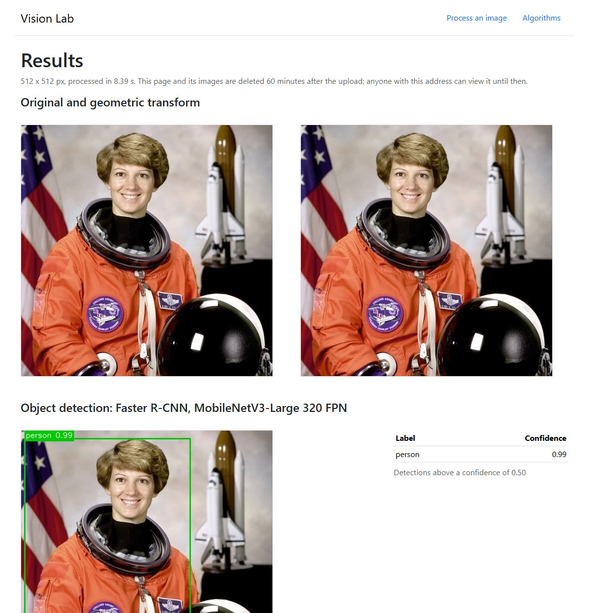

# vision-lab-flask

A small web application that applies classical image processing and pretrained deep-learning
vision models to an uploaded image, and shows every result next to the numbers behind it.
Status: version 1.0.0, beta, maintained as a portfolio project.

[](https://github.com/tudorandrian/vision-lab-flask/actions/workflows/ci.yml)
[](LICENSE)




## What it does

| Area | Operations |
| --- | --- |
| Geometric transform | rotation on a growing canvas, scaling, cropping, flipping |
| Smoothing | Gaussian blur, median blur |
| Edge detection | Canny, Sobel, Scharr, Roberts cross, Laplacian of Gaussian |
| Histogram equalisation | global, adaptive (AHE), contrast-limited adaptive (CLAHE), on the lightness channel |
| Enhancement | unsharp mask, non-local means denoising, brightness, contrast |
| Colour spaces | HSV, CIE L\*a\*b\*, greyscale and RGB, shown as separate channel planes |
| Object detection | Faster R-CNN, MobileNetV3-Large 320 FPN (default, low resolution for CPU speed), YOLOv5u (optional extra) |
| Semantic segmentation | DeepLabV3 over the 21 Pascal VOC classes, with the pixel share of each class |
| Facial expression estimate | DeepFace (optional extra, disabled by default) |

Every operation is described, with its reference, in [docs/algorithms.md](docs/algorithms.md)
and in the application under Algorithms. Both are generated from one table in the code.

## Run it

Three independent ways. Pick one; none of them needs Anaconda.

### A. With uv (recommended)

[uv](https://docs.astral.sh/uv/) is a single executable that installs the right Python version
and the locked dependencies into a project-local `.venv`.

```bash
git clone https://github.com/tudorandrian/vision-lab-flask.git
cd vision-lab-flask
uv sync
uv run vision-lab
```

Open <http://127.0.0.1:8000>. The first upload downloads about 120 MB of model weights (Faster
R-CNN and DeepLabV3) into `instance/weights`, about 23 MB more with the `yolo` extra installed;
later runs work offline.

### B. With Docker

```bash
docker compose up --build
```

Open <http://127.0.0.1:8000>. Weights and results live in the `vision-lab-data` volume. The
built image measures 2.08 GB.

### C. With plain pip

Requires Python 3.12 or 3.13 (`pyproject.toml` sets `requires-python`).

```bash
python3 -m venv .venv
.venv/bin/pip install . --extra-index-url https://download.pytorch.org/whl/cpu
.venv/bin/vision-lab
```

On Windows the two commands are `.venv\Scripts\pip` and `.venv\Scripts\vision-lab`, and the first
command is `python` instead of `python3`.
This route resolves dependencies afresh instead of using `uv.lock`.

### Optional extras

Each extra is independent of the other and of the base install.

| Extra | Adds | Install | Notes |
| --- | --- | --- | --- |
| `yolo` | YOLOv5nu and YOLOv5su detectors | `uv sync --extra yolo` | Ultralytics code and weights are AGPL-3.0. Usage analytics are switched off in code. |
| `emotion` | facial expression estimate | `uv sync --extra emotion`, then set `VISION_LAB_ENABLE_EMOTION=1` | Pulls in TensorFlow, a large download. Read the privacy section first. |

## Configuration

Environment variables, all optional.

| Variable | Default | Meaning |
| --- | --- | --- |
| `VISION_LAB_DATA_DIR` | `instance` | where weights and results are stored |
| `VISION_LAB_MAX_UPLOAD_MB` | `8` | larger uploads get HTTP 413 |
| `VISION_LAB_MAX_PIXELS` | `25000000` | larger images are rejected before decoding |
| `VISION_LAB_MAX_SIDE` | `1600` | images are reduced to this long side before processing |
| `VISION_LAB_JOB_TTL_MINUTES` | `60` | results older than this are deleted |
| `VISION_LAB_MAX_CONCURRENT_JOBS` | `1` | inferences running at the same time |
| `VISION_LAB_QUEUE_SECONDS` | `15` | how long an upload waits for a free slot before HTTP 503 |
| `VISION_LAB_ENABLE_EMOTION` | `0` | enables the `emotion` extra when it is installed |

## How it is tested

| Level | What it proves | Command |
| --- | --- | --- |
| Static | style, types, common security mistakes, known vulnerable dependencies | `uv run ruff check . && uv run mypy && uv run bandit -q -r src && uv run pip-audit --skip-editable` |
| Unit | each operation against synthetic images with exact numeric expectations | `uv run pytest` |
| Web | status codes, headers, validation, path traversal, privacy, failure and overload behaviour, with fake models | `uv run pytest` |
| Models | real weights find the person in the sample image | `uv run pytest -m models` |
| Browser | the upload journey in Chromium, no console errors, no third-party requests, no horizontal scrolling on a phone | `uv run playwright install chromium && uv run pytest -m e2e` |
| Load | latency and error counts under sequential and concurrent uploads | `uv run python scripts/smoke_load.py http://127.0.0.1:8000 samples/astronaut.jpg` |

The fast suite (unit and web) is 134 tests at 98.71 % line and branch coverage. Method, measured
numbers and known limits are in [docs/testing.md](docs/testing.md). The design is described in
[docs/architecture.md](docs/architecture.md).

## Privacy and security

- Uploads are decoded, re-encoded without metadata (no GPS position, no device data) and stored
  under a random UUID (122 random bits). The name of the uploaded file is never used.
- There is no gallery and no listing. A result can be opened only by someone who has its address.
  Results older than the configured time are deleted at the next upload or the next request for
  that result; nothing deletes them while the server is idle.
- The pages load no third-party resources and run no JavaScript, and they set a strict
  Content-Security-Policy.
- Model weights are downloaded from their publishers on first use and are not part of this repository.
- Facial expression analysis is off by default. Its output is a statistical guess about a visible
  expression and says nothing reliable about what a person feels. Do not use it to make decisions
  about people. Article 5(1)(f) of Regulation (EU) 2024/1689 (the AI Act) prohibits AI systems
  that infer the emotions of people in the workplace and in education institutions, except where
  used for medical or safety reasons.
- The server binds to the loopback interface by default. It has no authentication and is not meant
  to be exposed to the internet as it is.

To report a vulnerability, see [SECURITY.md](SECURITY.md).

## Project history

The project started in January 2025 as coursework in image processing at the West University of
Timisoara: one Flask file, written in a few days. That version is kept under the tag
[`v0.1.0-coursework`](https://github.com/tudorandrian/vision-lab-flask/tree/v0.1.0-coursework).
Version 1.0.0 (2026) keeps the scope and rebuilds the engineering: a tested package, validated
input, private storage, correct algorithms, reproducible dependencies and continuous integration.
[CHANGELOG.md](CHANGELOG.md) lists what changed and why.

## Licences and credits

- This project: GNU Affero General Public License, version 3 or later. See [LICENSE](LICENSE).
  The footer of every page links to this source code, as section 13 of the licence requires for
  network use.
- Bootstrap 5.3.8 (MIT) is vendored under `src/vision_lab/static/vendor/bootstrap`.
- torchvision (BSD-3-Clause); pretrained weights are subject to the terms of the datasets they
  were trained on (COCO, Pascal VOC, ImageNet). Ultralytics YOLOv5u: AGPL-3.0. DeepFace: MIT.
- Sample image: astronaut Eileen Collins, NASA, public domain. See [samples/README.md](samples/README.md).

## Citation

If you use this project in teaching or research, cite it using [CITATION.cff](CITATION.cff).
